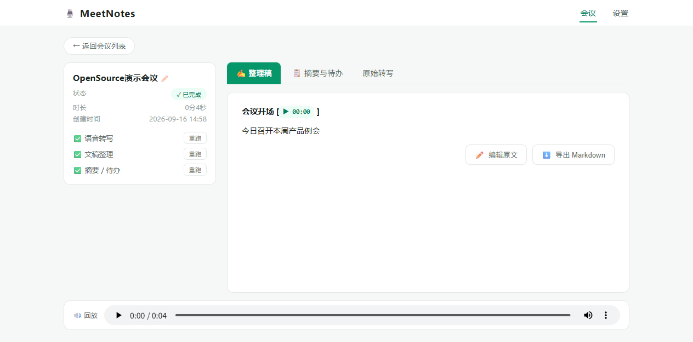
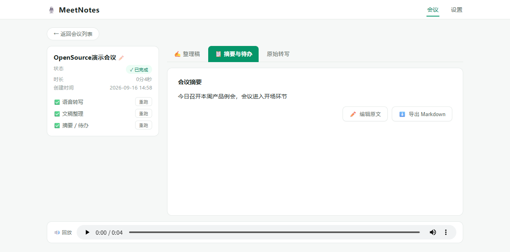

# MeetNotes · 轻量会议纪要系统

**Turn meeting recordings into polished minutes, summaries and action items — locally.**

本地优先的会议纪要工具：上传或录制音频 → 自动转录 → 文稿整理 → 结构化摘要与待办提取。提供 **Web UI** 与 **mn CLI** 双入口，共享同一数据源；CLI 可接入 codex / pi / claude 等本地 Agent，把会议能力交给 AI 编排。

<div align="center">
  
  <p><sub>文稿整理视图：点段落跳转回放 · 底部音频条横跨全宽</sub></p>
  
  <p><sub>摘要视图：要点 / 待办清单，支持行内编辑</sub></p>
</div>

## 功能特性

- **转录流水线**：ffmpeg 静音感知切片 → 并行语音转写 → 按时间戳合并 → LLM 文稿整理 → 结构化摘要/待办
- **LLM 加工**：热门专名写进热词表即可在整理稿中自动纠正；参会人名单辅助说话人指代消解
- **双引擎**：默认火山方舟，ASR 模型与文本模型（润色/摘要）独立设置；可切换本地 faster-whisper 离线运行
- **Web UI**：录音/上传、进度可视化、点击文稿跳转音频回放、行内编辑整理稿/摘要、导出 Markdown、失败步骤单独重跑
- **mn CLI**：8 个子命令 + `--json` 机器输出，供 Agent 与脚本调用，与 Web 共享数据库
- **Agent 零配置接入**：内置 SKILL.md，codex / pi / claude 自动发现并按文档调用

## 快速开始

前提：Python 3.11+、ffmpeg（已在 PATH）。

### 1. 启动

```bat
git clone https://github.com/david98little/meetnotes.git
cd meetnotes
start.bat        :: 首次运行自动创建虚拟环境并安装依赖，然后打开 http://localhost:8618
```

macOS / Linux：

```bash
git clone https://github.com/david98little/meetnotes.git
cd meetnotes
./start.sh       # 同样自动建环境；macOS 需先 brew install ffmpeg
```

### 2. 配置转录引擎

默认**双厂商组合**：语音识别走火山方舟（豆包），文本生成走 DeepSeek 官方（`deepseek-flash`，自动关闭思考模式提速）。两组各自独立配置 Base URL / API Key / 模型，可自由混搭任意 OpenAI 兼容端点。

配置方式二选一：

- 在 Web 设置页分别填写「方舟 API Key（ASR）」与「文本 API Key」（推荐）
- 或复制 `.env.example` 为 `.env` 填入方舟 Key（仅引导 ASR；文本 Key 在设置页或 `data/config.json` 的 `llm.api_key`）

切换本地离线引擎：`pip install faster-whisper`，然后在设置页把转录引擎切为 Whisper Local。

### 3. 处理第一场会议

网页拖入音频，或直接：

```bash
mn transcribe 会议录音.m4a --title 项目周例会
```

## mn CLI

`mn` 与 Web 共享同一 SQLite 数据库与音频目录，两个入口随便进。

| 命令 | 用途 |
|---|---|
| `mn transcribe <音频> [--title]` | 转录 + 全套纪要（阻塞式，进度走 stderr） |
| `mn list [--json]` | 会议列表 |
| `mn show <id> [--part summary\|polished\|transcript]` | 查看摘要 / 整理稿 / 原始转写 |
| `mn search <关键词> [--json]` | 全文检索（标题 / 转写 / 文稿） |
| `mn todo [id] [--json]` | 待办提取，无 id 汇总全部已完成会议 |
| `mn export <id> [--out 文件.md]` | 导出 Markdown |
| `mn rename <id> <新标题>` / `mn remove <id> [--yes]` | 管理操作 |

所有命令支持 `--json` 输出机器可读 JSON。

## 接入本地 Agent（codex / pi / claude）

仓库内置 [skills/meetnotes/SKILL.md](skills/meetnotes/SKILL.md)。把它复制进 Agent 的 skill 目录即可：

```bash
# 三家共享目录（本机有多个 Agent 时推荐），macOS / Linux / Windows(Git Bash) 通用
cp -r skills/meetnotes ~/.agents/skills/

# 或仅 Claude Code
cp -r skills/meetnotes ~/.claude/skills/
```

**注册 `mn` 命令：**

- **Windows**：复制 `mn.cmd.example` 为 `mn.cmd`，改两处项目路径，放到 PATH 目录（如 `%APPDATA%\npm`）
- **macOS / Linux**：`cp mn.sh.example mn && chmod +x mn && sudo cp mn /usr/local/bin/`，同样先改脚本内项目路径

之后直接用自然语言驱动 Agent：「把本周所有会议的待办汇总成清单」「搜一下哪场会议聊过登录模块」——Agent 会自己调用 `mn` 完成检索与汇总。

## 平台支持

| 平台 | 状态 |
|---|---|
| Windows 10/11 | ✅ 一键 start.bat + mn.cmd |
| macOS (Intel/Apple Silicon) | ✅ start.sh；ffmpeg via Homebrew；faster-whisper 走 CPU |
| Linux | ✅ start.sh；ffmpeg via 包管理器 |

前后端核心代码无平台专属依赖；页面录音需 Chrome/Edge 等支持 getUserMedia 的浏览器。

## 架构

```
meetnotes/
├── cli.py             # mn CLI（复用 server/ 核心层，与 Web 共享数据）
├── server/            # FastAPI 后端
│   ├── main.py        # 路由与静态托管
│   ├── pipeline.py    # 任务状态机: 归一化→转写→润色→摘要
│   ├── providers.py   # 可插拔能力层: 方舟 ASR/LLM、本地 Whisper
│   ├── audio_utils.py # ffmpeg 切片(静音感知)/归一化
│   ├── prompts.py     # 整理与摘要提示词
│   └── db.py          # SQLite (meetings/segments/artifacts)
├── web/               # 原生 JS 单页前端（零构建零 CDN）
├── skills/meetnotes/  # Agent skill 定义（SKILL.md）
└── data/              # 运行时数据: meet.db + 音频（不入库）
```

## 技术说明

- **切片策略**：先 16kHz 单声道归一化，在静音中点切分 120–1800s 片段并行转写，避免切断词语
- **ASR 与文本模型独立配置**：`asr` 与 `llm` 两通道各自 `base_url / api_key / model`，互不影响，跨厂商混搭
- **方舟直调模型名需带版本号**（如 `deepseek-v4-flash-ga-260731`，裸名会 404）；DeepSeek 官方模型名不带版本号（如 `deepseek-flash`）
- **deepseek 系思考模型自动关闭思考**（`llm.thinking: disabled`，可改 `enabled` 换取更深推理）
- **热词修正**：热词与参会人注入整理提示词，专有名词（产品名、内部系统名）可在文稿层自动纠正
- **状态机**：每场会议 queued → processing → done/failed，任一步骤失败可单独重跑
- **扩展引擎**：`server/providers.py` 抽象了转写与文本生成接口，新增引擎只需实现两个方法

## 安全说明

- API Key 只保存在本机（`.env` 或 `data/config.json`），两者均被 `.gitignore` 排除
- 音频与转录数据全部存本地 `data/`，不经第三方转存
- Web 服务默认仅监听 `127.0.0.1`，不暴露局域网

## License

[MIT](LICENSE)
